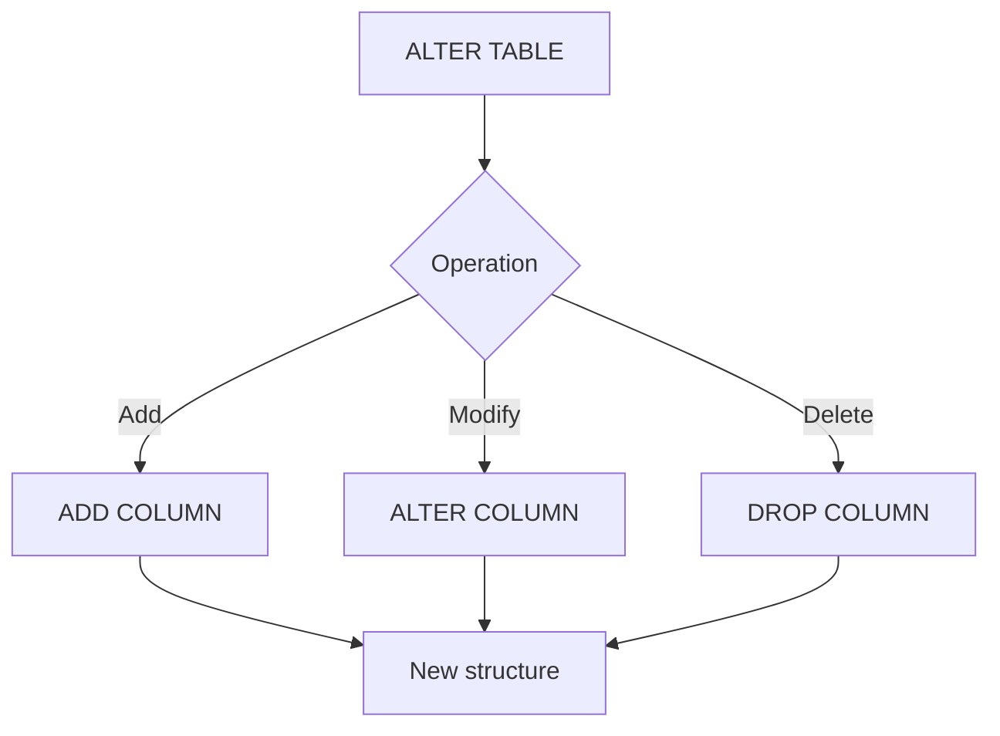

# SQL Data Definition Language (DDL): ALTER Command

## Introduction to DDL

Data Definition Language (DDL) is a subset of SQL used to define and modify the structure of database objects. The main DDL commands are:

1. CREATE
2. ALTER
3. DROP
4. TRUNCATE

This document focuses on the ALTER command, particularly its application to tables.

## The ALTER Command

ALTER is used to modify the structure of existing database objects. While it can be applied to various objects like views, functions, and stored procedures, we'll concentrate on its usage with tables.

### ALTER TABLE Operations

ALTER TABLE can perform three main operations:

1. Add new elements
2. Modify existing elements
3. Delete elements

Let's explore each of these operations with examples.

#### 1. Adding a New Column

To add a new column to a table:

```sql
ALTER TABLE Employees 
ADD Test int;
```

This command adds a new column named "Test" of type integer to the Employees table.

#### 2. Modifying an Existing Column

To modify an existing column:

```sql
ALTER TABLE Employees 
ALTER COLUMN Test bigint;
```

This command changes the data type of the "Test" column from int to bigint.

#### 3. Deleting a Column

To delete a column from a table:

```sql
ALTER TABLE Employees 
DROP COLUMN Test;
```

This command removes the "Test" column from the Employees table.

## Summary Table

| Operation | Syntax | Description |
|-----------|--------|-------------|
| Add | `ALTER TABLE table_name ADD column_name datatype;` | Adds a new column to the table |
| Modify | `ALTER TABLE table_name ALTER COLUMN column_name new_datatype;` | Changes the data type of an existing column |
| Delete | `ALTER TABLE table_name DROP COLUMN column_name;` | Removes a column from the table |

## ALTER Command Flow



This diagram illustrates the flow of the ALTER TABLE command and its operations.

## Best Practices

1. **Backup**: Always backup your database before performing ALTER operations, especially in production environments.
2. **Testing**: Test ALTER operations in a development environment before applying them to production.
3. **Performance**: Be aware that ALTER operations on large tables can be time-consuming and may lock the table.
4. **Dependencies**: Consider the impact of your changes on dependent objects like views, indexes, or constraints.

## Conclusion

The ALTER command is a powerful tool for modifying database structures. While this document focused on ALTER TABLE, remember that ALTER can be used on various database objects, with syntax and available operations varying depending on the object type.

Always consider the implications of structural changes to your database, and follow best practices to ensure data integrity and system stability.
