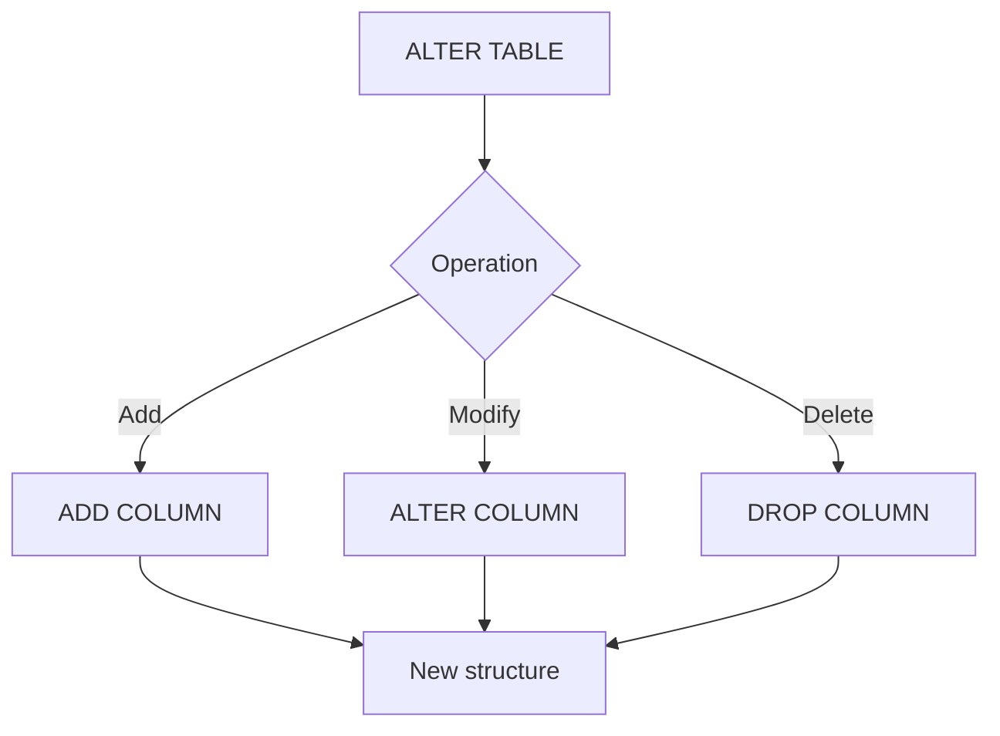

# SQL Data Definition Language (DDL): ALTER Command

## Introduction to DDL

Data Definition Language (DDL) is a subset of SQL used to define and modify the structure of database objects. The main DDL commands are:

1. CREATE
2. ALTER
3. DROP
4. TRUNCATE

This document focuses on the ALTER command, particularly its application to tables.

## The ALTER Command

ALTER is used to modify the structure of existing database objects. While it can be applied to various objects like views, functions, and stored procedures, we'll concentrate on its usage with tables.

### ALTER TABLE Operations

ALTER TABLE can perform three main operations:

1. Add new elements
2. Modify existing elements
3. Delete elements

Let's explore each of these operations with examples.

#### 1. Adding a New Column

To add a new column to a table:

```sql
ALTER TABLE Employees 
ADD Test int;
```

This command adds a new column named "Test" of type integer to the Employees table.

#### 2. Modifying an Existing Column

To modify an existing column:

```sql
ALTER TABLE Employees 
ALTER COLUMN Test bigint;
```

This command changes the data type of the "Test" column from int to bigint.

#### 3. Deleting a Column

To delete a column from a table:

```sql
ALTER TABLE Employees 
DROP COLUMN Test;
```

This command removes the "Test" column from the Employees table.

## Summary Table

| Operation | Syntax | Description |
|-----------|--------|-------------|
| Add | `ALTER TABLE table_name ADD column_name datatype;` | Adds a new column to the table |
| Modify | `ALTER TABLE table_name ALTER COLUMN column_name new_datatype;` | Changes the data type of an existing column |
| Delete | `ALTER TABLE table_name DROP COLUMN column_name;` | Removes a column from the table |

## ALTER Command Flow



This diagram illustrates the flow of the ALTER TABLE command and its operations.

## Best Practices

1. **Backup**: Always backup your database before performing ALTER operations, especially in production environments.
2. **Testing**: Test ALTER operations in a development environment before applying them to production.
3. **Performance**: Be aware that ALTER operations on large tables can be time-consuming and may lock the table.
4. **Dependencies**: Consider the impact of your changes on dependent objects like views, indexes, or constraints.

## Conclusion

The ALTER command is a powerful tool for modifying database structures. While this document focused on ALTER TABLE, remember that ALTER can be used on various database objects, with syntax and available operations varying depending on the object type.

Always consider the implications of structural changes to your database, and follow best practices to ensure data integrity and system stability.


# Employee and Department Table Structures and Relationships

## Table Structures

### Employee Table

```sql
Create Table Employees
(
    Id int Primary Key Identity(1, 1),
    FName varchar(20) Not Null, --Required
    LName varchar(20), -- Optional
    BDate Date,
    EmpAddress varchar(30) default 'Cairo',
    Gender char(1),
    Salary money,
    SuperId int references Employees(Id), -- Self Relationship
    DepartmentNumber int
)
```

#### Fields:
- **Id**: Integer, Primary Key, Auto-incrementing
- **FName**: Varchar(20), Required (Not Null)
- **LName**: Varchar(20), Optional
- **BDate**: Date
- **EmpAddress**: Varchar(30), Default value 'Cairo'
- **Gender**: Char(1)
- **Salary**: Money type
- **SuperId**: Integer, Foreign Key referencing Employees(Id)
- **DepartmentNumber**: Integer

### Department Table

Based on the diagram, the Department table likely has the following structure:

```sql
Create Table Department
(
    DNumber int Primary Key,
    DName varchar(50),
    MGRSSN int,
    MGRStartDate Date
)
```

#### Fields:
- **DNumber**: Integer, Primary Key
- **DName**: Varchar(50)
- **MGRSSN**: Integer
- **MGRStartDate**: Date

## Relationships

1. **Employee Self-Relationship**:
   - The `SuperId` in the Employee table references the `Id` of another employee, representing a supervisory relationship.
   - This creates a hierarchical structure within the Employees table.

2. **Employee-Department Relationship**:
   - The `DepartmentNumber` in the Employee table is a foreign key that references the `DNumber` in the Department table.
   - This represents a many-to-one relationship: many employees can belong to one department.

3. **Department-Employee (Manager) Relationship**:
   - The `MGRSSN` in the Department table likely references the `SSN` (or possibly `Id`) of an employee in the Employee table.
   - This represents the manager of the department, creating a one-to-one relationship between a department and its manager.

## Notable Points

1. **Primary Keys**: 
   - Employee table uses an auto-incrementing `Id` as the primary key.
   - Department table uses `DNumber` as the primary key.

2. **Foreign Keys**:
   - `SuperId` in Employees table (self-referencing)
   - `DepartmentNumber` in Employees table
   - `MGRSSN` in Department table

3. **Default Values**:
   - `EmpAddress` has a default value of 'Cairo'

4. **Data Types**:
   - Use of `varchar` for names and addresses
   - `char(1)` for Gender, suggesting a single character code
   - `money` type for Salary, ensuring proper handling of currency values

5. **Constraints**:
   - `FName` is marked as Not Null, making it a required field
   - `LName` is optional

This structure allows for a flexible representation of employees and departments, including hierarchical employee relationships and the association of employees with departments.


# SQL: Foreign Keys and DROP Command

## 1. Foreign Key Relationships

### 1.1 Understanding Foreign Keys

Foreign keys are used to establish relationships between tables in a relational database. In our example:

- We have an Employees table and a Departments table.
- This forms a one-to-many relationship: one department can have many employees.
- The Employees table (the "many" side) has a foreign key that references the Departments table (the "one" side).

### 1.2 Implementing Foreign Keys

#### In Table Design:

The foreign key relationship is represented as:

```sql
DepartmentNumber int REFERENCES Departments(DNumber)
```

#### Using ALTER TABLE:

To add a foreign key constraint to an existing table:

```sql
ALTER TABLE Employees
ADD FOREIGN KEY (DepartmentNumber) REFERENCES Departments(DNumber)
```

### 1.3 Visualizing Relationships in SSMS

To view and manage relationships in SQL Server Management Studio (SSMS):

1. Open your database diagram in SSMS.
2. Locate the relationship line between Employees and Departments tables.
3. Right-click on the relationship line.
4. Select "Properties" from the context menu.
5. Review the relationship details in the Properties window.

Note: Always save your diagram before making changes.

To refresh the diagram after making changes:
1. Close the current diagram window.
2. Right-click on "Database Diagrams" in the Object Explorer.
3. Select "Refresh".
4. Reopen your diagram to see the updates.

## 2. The DROP Command

The DROP command is used to remove database objects entirely. It's a powerful command that should be used with caution.

### 2.1 Dropping a Database

To remove an entire database:

```sql
DROP DATABASE CompanyG02
```

Warning: This will delete all tables, data, and other objects within the database.

### 2.2 Dropping a Table

To remove a specific table:

```sql
DROP TABLE Employees 
```

Caution: This will delete the table structure and all data within the table.

### 2.3 Dropping a Column

Unlike dropping databases or tables, dropping a column requires the ALTER TABLE command:

```sql
ALTER TABLE Employees
DROP COLUMN ColumnName
```

This removes the specified column and its data from the table.

## 3. Best Practices and Considerations

1. **Backup**: Always create a backup before performing DROP or ALTER operations, especially in production environments.

2. **Dependencies**: Before dropping objects, check for dependencies. Dropping a table or column might affect views, indexes, or constraints.

3. **Cascading Effects**: Be aware of cascading delete rules when dropping tables with foreign key relationships.

4. **Testing**: Test DROP and ALTER operations in a development environment before applying them to production.

5. **Permissions**: Ensure you have the necessary permissions to perform these operations.

6. **Documentation**: Keep your database schema documentation up-to-date after making structural changes.

## Conclusion

Understanding how to manage foreign key relationships and use the DROP command effectively is crucial for maintaining database integrity and structure. Always approach these operations with caution, especially in production environments, and ensure you understand the full implications of your actions.


# Creating a Database Using SQL Server Management Studio Wizard

## Using the SSMS Wizard

1. Open SQL Server Management Studio (SSMS).
2. In the Object Explorer, navigate to the "Databases" folder.
3. Right-click on "Databases" and select "New Database".
4. Name your database (e.g., "CompanyG02UsingWizard").
5. Configure settings as needed or use defaults.
6. Click "OK" to create the database.

## Database Files

When you create a database, two main files are generated:

### 1. Data File (.mdf)
- Contains the actual data and metadata of the database.
- Stores information such as:
  - Database name
  - Owner
  - Creation time
  - Table names
  - Column names
- Usually one primary .mdf file, but can have multiple.
- Default initial size: 8 MB
- Default autogrowth: 64 MB (unlimited)

### 2. Log File (.ldf)
- Stores transaction logs.
- Records all transactions (inserts, updates, deletes).
- Used for database recovery and backups.
- Usually one .ldf file per database.
- Default initial size: 8 MB
- Default autogrowth: 64 MB (unlimited)

## Important Notes

1. **File Customization**: You can modify the initial size and autogrowth settings for both .mdf and .ldf files.

2. **Database Transfer**: 
   - You can transfer a database by giving someone both .mdf and .ldf files.
   - However, this requires stopping the database service and is not recommended.

3. **Recommended Transfer Method**:
   - Create a backup of the database.
   - Share the backup file.
   - The recipient can then restore the database from the backup.

4. **Wizard vs. Code**: 
   - The wizard provides a user-friendly interface for database creation.
   - Behind the scenes, it generates and executes SQL code.

5. **Backup Types**: 
   - Various backup types exist, including log file backups.
   - Log file backups can be used for point-in-time recovery.

## Best Practices

1. Regularly backup your databases.
2. Use the backup and restore method for transferring databases when possible.
3. Monitor and adjust file sizes and growth settings for optimal performance.
4. Familiarize yourself with both the wizard interface and the underlying SQL commands for database management.


# Creating a Table Using SQL Server Management Studio GUI

## Steps to Create a New Table

1. Right-click on "Tables" in your database.
2. Select "New Table" from the context menu.

## Designing the Table

The table design view opens with three columns:
- Column Name
- Data Type
- Allow Nulls

### Adding Columns

1. Click in the "Column Name" field and enter the name.
2. Use the drop-down in "Data Type" to select the appropriate type.
3. Check or uncheck "Allow Nulls" as needed.
4. Use Tab to move forward, Shift+Tab to move backward between fields.

### Setting the Primary Key

1. Right-click on the column you want as the primary key (e.g., "Id").
2. Choose "Set Primary Key" from the context menu.

### Adding Identity Specification

1. Click on the primary key column (e.g., "Id").
2. In the Properties window below:
   - Find "Identity Specification"
   - Set "Is Identity" to "Yes"
   - Adjust "Identity Seed" and "Identity Increment" if needed (default is 1,1)

### Setting Default Values

1. Click on the column you want to set a default value for (e.g., "Address").
2. In the Properties window:
   - Find "Default Value or Binding"
   - Enter the default value (e.g., 'Cairo')

## Saving the Table

1. Press Ctrl + S or click the Save icon.
2. Enter a name for your table (e.g., "Employees").
3. Click "OK" to save.

## Important Notes

- Changes are not saved automatically. Look for an asterisk (*) in the tab name to indicate unsaved changes.
- Always review your table design before saving to ensure all specifications are correct.
- You can modify the table design later, but some changes might require dropping and recreating the table if it contains data.

## Table Structure (Based on the Image)

| Column Name       | Data Type    | Allow Nulls |
|-------------------|--------------|-------------|
| Id                | int          | ☐           |
| FName             | varchar(50)  | ☐           |
| LName             | varchar(50)  | ☑           |
| BDate             | date         | ☑           |
| Salary            | money        | ☑           |
| Address           | varchar(50)  | ☑           |
| Gender            | char(1)      | ☑           |
| SupervisorId      | int          | ☑           |
| DepartmentNumber  | int          | ☑           |

Note: ☐ indicates "Not Null", ☑ indicates "Allow Null"


# Creating Tables and Relationships in SQL Server Management Studio

## Table Structures

### Departments Table
| Column Name  | Data Type   | Allow Nulls |
|--------------|-------------|-------------|
| DNumber      | int         | ☐           |
| DName        | varchar(50) | ☐           |
| ManagerId    | int         | ☑           |
| MGRStartDate | date        | ☑           |

### Employees Table
| Column Name       | Data Type   | Allow Nulls |
|-------------------|-------------|-------------|
| Id                | int         | ☐           |
| FName             | varchar(50) | ☐           |
| LName             | varchar(50) | ☑           |
| BDate             | date        | ☑           |
| Salary            | money       | ☑           |
| Address           | varchar(50) | ☑           |
| Gender            | char(1)     | ☑           |
| SupervisorId      | int         | ☑           |
| DepartmentNumber  | int         | ☑           |

### Junction Table (for multivalued attributes)
| Column Name       | Data Type | Allow Nulls |
|-------------------|-----------|-------------|
| DepartmentNumber  | int       | ☑           |
| Location          | int       | ☑           |

Note: ☐ indicates "Not Null", ☑ indicates "Allow Null"

## Creating Composite Primary Keys

For tables with multivalued attributes (like the junction table):

1. Click on the first column you want in the composite key.
2. Hold Ctrl and click on the other column(s) you want to include.
3. Right-click on the selected columns and choose "Set Primary Key".

## Creating Relationships Using Database Diagram

1. Right-click on "Database Diagrams" in your database.
2. Select "New Database Diagram".
3. Choose the tables you want to include (e.g., Departments, Employees, and the junction table).
4. Click "Add" to add the selected tables to the diagram.

### Creating a Self-Relationship (Employees table)

1. Drag the primary key column (Id) from the Employees table to the SupervisorId column in the same table.
2. In the "Create Relationship" dialog:
   - Verify the relationship name
   - Confirm the primary key and foreign key tables
   - Click "OK"
3. In the "Foreign Key Relationship" dialog:
   - Review the default configuration
   - Click "OK" to create the relationship

This creates a self-relationship where SupervisorId references the Id of another employee.

### Creating Other Relationships

Follow a similar process for other relationships:
- Drag the primary key from one table to the corresponding foreign key in another table.
- Configure the relationship as needed in the dialogs that appear.

## Important Notes

- Ensure that foreign key columns have the same data type as the primary key columns they reference.
- The values in foreign key columns (e.g., SupervisorId) must correspond to existing values in the referenced primary key column.
- Use the database diagram to visualize and manage relationships between tables.
- You can modify relationships after creation, but be cautious with existing data.


# Key Points: Relationships and SSMS Options in SQL Server Management Studio

## Viewing Relationship Properties

1. Right-click on the relationship line in the database diagram.
2. Select "Properties" to view the Tables and Columns Specification.
3. This shows details like Foreign Key Base Table, Foreign Key Columns, and corresponding Primary/Unique Key information.

## Important Notes

- Unsaved changes are indicated by an asterisk (*) in the tab name.
- Review properties before saving to ensure correct relationship configuration.

## SSMS Options for Table Designer

To access: Tools > Options > Designers > Table and Database Designers

Key option to note:
- "Prevent saving changes that require table re-creation" 
  - When unchecked, allows changes that might require recreating tables.
  - Use with caution, especially in production environments.

## Wizard Interface for DDL

- The SSMS wizard provides a graphical interface for Data Definition Language (DDL) operations.
- It offers a user-friendly way to manage database structures and relationships.
- Understanding the implications of each option is crucial, especially for production databases.

Remember: While the wizard interface is convenient, it's important to understand the underlying SQL operations it generates and their potential impacts on your database structure and data.
